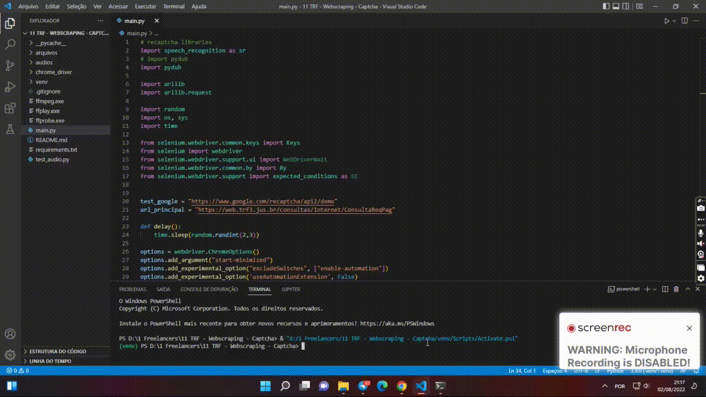

#WebScraping - Desbloquear Capthca

## Automação feita para desbloquear reCaptchas.

**Espero ter ajudado com esta dica**

**Instale as libs no requirements.txt e execute após  python -m main**

**`Lembrando que tem reCaptchas que usa audio de diferentes liguágens, é só alterar no campo (key = r.recognize_google(audio, language='en')) a (language) para a que deseja por exempor: language='pt-br'`**

